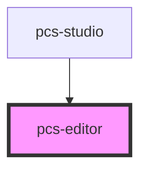

# test-codemirror

<!-- Auto Generated Below -->

## Properties

| Property       | Attribute       | Description | Type     | Default     |
| -------------- | --------------- | ----------- | -------- | ----------- |
| `initialValue` | `initial-value` |             | `string` | `undefined` |

## Events

| Event             | Description | Type                  |
| ----------------- | ----------- | --------------------- |
| `chordProUpdated` |             | `CustomEvent<string>` |

## Dependencies

### Used by

 - [pcs-studio](../studio)

### Graph

----------------------------------------------

*Built with [StencilJS](https://stenciljs.com/)*
