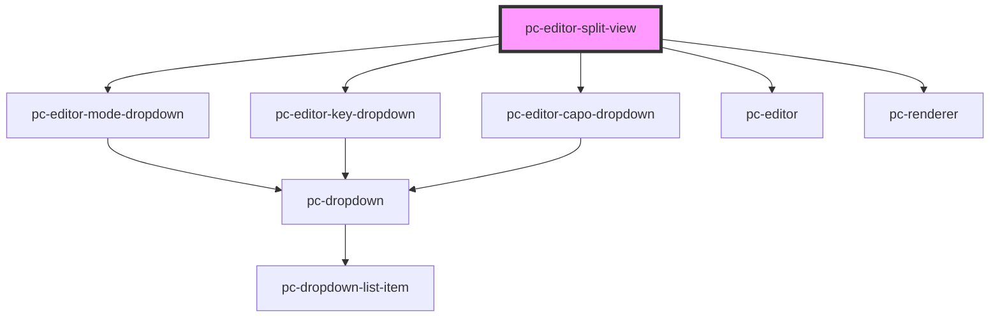

# pc-studio

<!-- Auto Generated Below -->

## Properties

| Property | Attribute | Description | Type     | Default     |
| -------- | --------- | ----------- | -------- | ----------- |
| `value`  | `value`   |             | `string` | `undefined` |

## Dependencies

### Depends on

- [pc-editor-mode-dropdown](../editor-mode-dropdown)
- [pc-editor-key-dropdown](../editor-key-dropdown)
- [pc-editor-capo-dropdown](../editor-capo-dropdown)
- [pc-editor](../editor)
- [pc-renderer](../renderer)

### Graph

----------------------------------------------

*Built with [StencilJS](https://stenciljs.com/)*
