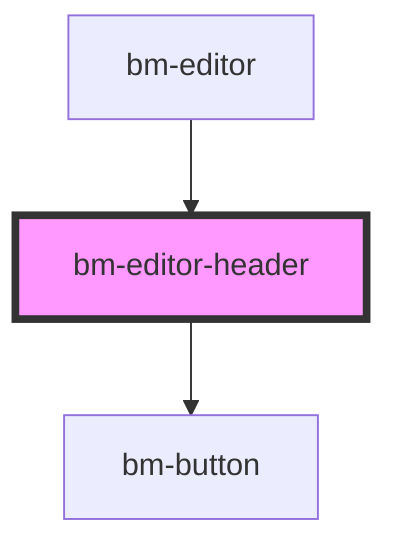

# test-codemirror

<!-- Auto Generated Below -->

## Dependencies

### Used by

 - [bm-editor](../editor)

### Depends on

- [bm-button](../../ui/button)

### Graph

----------------------------------------------

*Built with [StencilJS](https://stenciljs.com/)*
