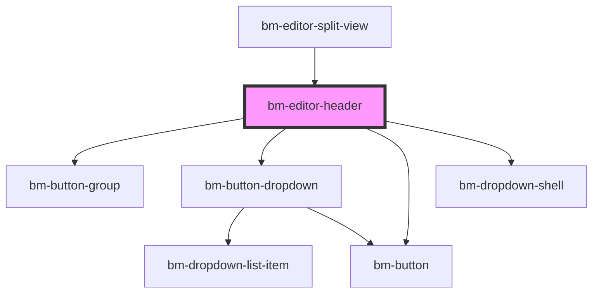

# test-codemirror

<!-- Auto Generated Below -->

## Dependencies

### Used by

 - [bm-editor-split-view](../editor-split-view)

### Depends on

- [bm-button-group](../../ui/button-group)
- [bm-button-dropdown](../../ui/button-dropdown)
- [bm-button](../../ui/button)
- [bm-dropdown-shell](../../ui/dropdown-shell)

### Graph

----------------------------------------------

*Built with [StencilJS](https://stenciljs.com/)*
