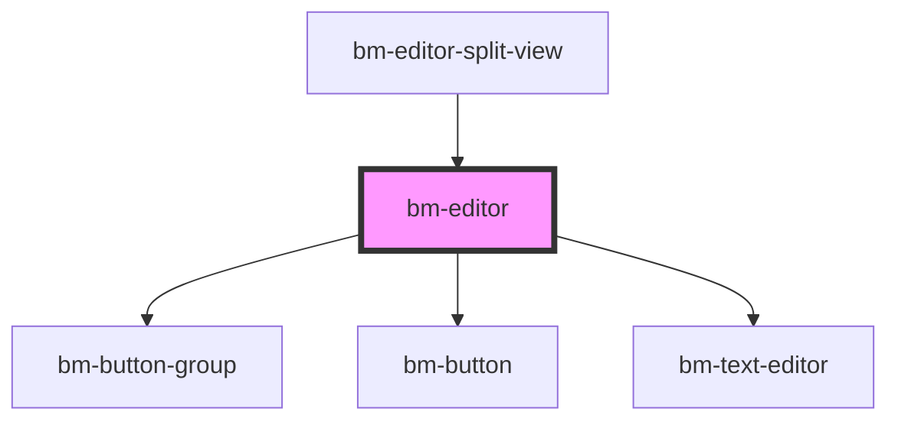

# test-codemirror

<!-- Auto Generated Below -->

## Properties

| Property       | Attribute       | Description | Type     | Default     |
| -------------- | --------------- | ----------- | -------- | ----------- |
| `initialValue` | `initial-value` |             | `string` | `undefined` |

## Dependencies

### Used by

 - [bm-editor-split-view](../editor-split-view)

### Depends on

- [bm-button-group](../../ui/button-group)
- [bm-button](../../ui/button)
- [bm-text-editor](../text-editor)

### Graph

----------------------------------------------

*Built with [StencilJS](https://stenciljs.com/)*
