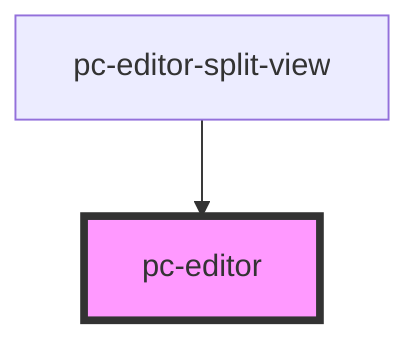

# test-codemirror

<!-- Auto Generated Below -->

## Properties

| Property | Attribute | Description | Type     | Default     |
| -------- | --------- | ----------- | -------- | ----------- |
| `value`  | `value`   |             | `string` | `undefined` |

## Methods

### `setCapo(capoPosition: number) => Promise<void>`

#### Returns

Type: `Promise<void>`

## Dependencies

### Used by

 - [pc-editor-split-view](../editor-split-view)

### Graph

----------------------------------------------

*Built with [StencilJS](https://stenciljs.com/)*
