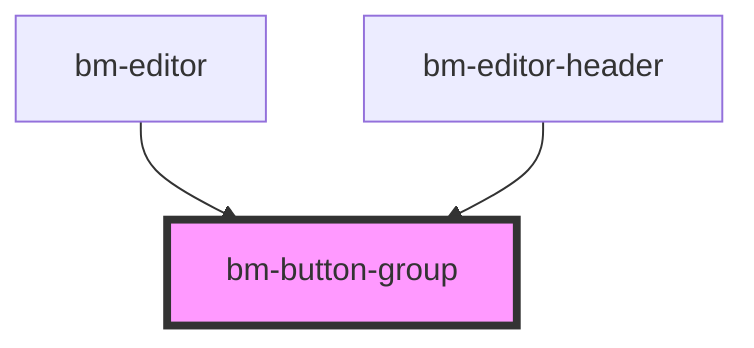

# bm-button

<!-- Auto Generated Below -->

## Properties

| Property         | Attribute         | Description | Type      | Default     |
| ---------------- | ----------------- | ----------- | --------- | ----------- |
| `combined`       | `combined`        |             | `boolean` | `false`     |
| `containerProps` | `container-props` |             | `any`     | `undefined` |

## Shadow Parts

| Part             | Description |
| ---------------- | ----------- |
| `"button-group"` |             |

## Dependencies

### Used by

 - [bm-editor](../../editor/editor)
 - [bm-editor-header](../../editor/editor-header)

### Graph

----------------------------------------------

*Built with [StencilJS](https://stenciljs.com/)*
