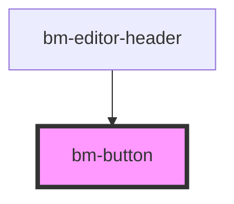

# bm-button

<!-- Auto Generated Below -->

## Properties

| Property    | Attribute    | Description | Type                                                     | Default     |
| ----------- | ------------ | ----------- | -------------------------------------------------------- | ----------- |
| `color`     | `color`      |             | `"destructive" \| "minimal" \| "primary" \| "secondary"` | `"primary"` |
| `disabled`  | `disabled`   |             | `boolean`                                                | `undefined` |
| `endIcon`   | `end-icon`   |             | `string`                                                 | `undefined` |
| `loading`   | `loading`    |             | `boolean`                                                | `undefined` |
| `size`      | `size`       |             | `"base" \| "icon" \| "lg" \| "sm"`                       | `'base'`    |
| `startIcon` | `start-icon` |             | `string`                                                 | `undefined` |
| `text`      | `text`       |             | `string`                                                 | `undefined` |

## Dependencies

### Used by

 - [bm-editor-header](../../editor/editor-header)

### Graph

----------------------------------------------

*Built with [StencilJS](https://stenciljs.com/)*
