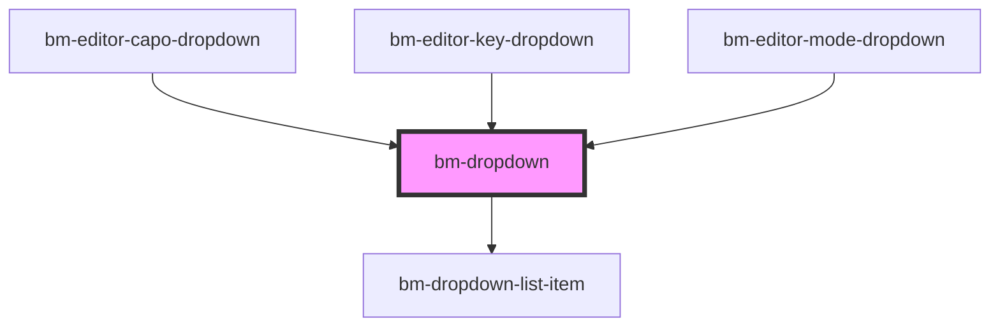

# bm-dropdown

<!-- Auto Generated Below -->

## Properties

| Property        | Attribute        | Description                              | Type                    | Default     |
| --------------- | ---------------- | ---------------------------------------- | ----------------------- | ----------- |
| `appendTo`      | `append-to`      | Where to append element                  | `"body" \| "current"`   | `'body'`    |
| `autoClose`     | `auto-close`     | Should dropdown autoclose on changeValue | `boolean`               | `true`      |
| `autoFocus`     | `auto-focus`     |                                          | `boolean`               | `false`     |
| `autocomplete`  | `autocomplete`   |                                          | `boolean`               | `false`     |
| `currentFilter` | `current-filter` | Filter value                             | `any`                   | `undefined` |
| `dataId`        | `data-id`        | Define object mapping for id/value       | `string`                | `undefined` |
| `dataLabel`     | `data-label`     | Define object mapping for labels         | `string`                | `undefined` |
| `filter`        | `filter`         | Filter criteria                          | `"contains" \| "start"` | `undefined` |
| `hasFilter`     | `has-filter`     |                                          | `boolean`               | `true`      |
| `maxHeight`     | `max-height`     |                                          | `number`                | `undefined` |
| `placeholder`   | `placeholder`    | Placeholder text                         | `string`                | `'Select'`  |
| `source`        | --               | Define object mapping for id/value       | `any[]`                 | `[]`        |
| `value`         | `value`          | Selected value                           | `any`                   | `undefined` |

## Events

| Event     | Description                            | Type                                                     |
| --------- | -------------------------------------- | -------------------------------------------------------- |
| `changed` | When value changed                     | `CustomEvent<{ val: any; originalEvent?: MouseEvent; }>` |
| `close`   | Before element close, can be prevented | `CustomEvent<any>`                                       |
| `open`    | Before element open, can be prevented  | `CustomEvent<any>`                                       |

## Methods

### `doChange(val: any, originalEvent?: MouseEvent) => Promise<void>`

Change value

#### Returns

Type: `Promise<void>`

### `doClose(isDisconnected?: boolean) => Promise<void>`

Close dropdown

#### Returns

Type: `Promise<void>`

### `doOpen() => Promise<void>`

Open dropdown

#### Returns

Type: `Promise<void>`

## Dependencies

### Used by

 - [bm-editor-capo-dropdown](../../editor/editor-capo-dropdown)
 - [bm-editor-key-dropdown](../../editor/editor-key-dropdown)
 - [bm-editor-mode-dropdown](../../editor/editor-mode-dropdown)

### Depends on

- [bm-dropdown-list-item](../dropdown-list-item)

### Graph

----------------------------------------------

*Built with [StencilJS](https://stenciljs.com/)*
