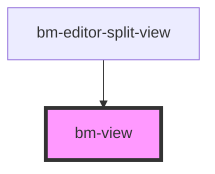

# bm-renderer

<!-- Auto Generated Below -->

## Properties

| Property | Attribute | Description | Type     | Default     |
| -------- | --------- | ----------- | -------- | ----------- |
| `html`   | `html`    |             | `string` | `undefined` |
| `mode`   | `mode`    |             | `string` | `undefined` |

## Dependencies

### Used by

 - [bm-editor-split-view](../editor/editor-split-view)

### Graph

----------------------------------------------

*Built with [StencilJS](https://stenciljs.com/)*
