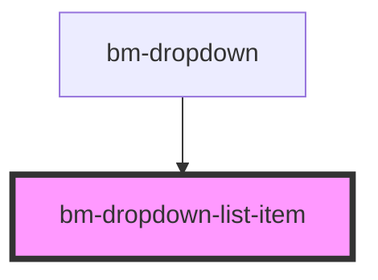

# bm-list

<!-- Auto Generated Below -->

## Properties

| Property      | Attribute    | Description                        | Type      | Default     |
| ------------- | ------------ | ---------------------------------- | --------- | ----------- |
| `dataLabel`   | `data-label` | Define object mapping for labels   | `string`  | `undefined` |
| `isFocused`   | `is-focused` |                                    | `boolean` | `false`     |
| `sourceItems` | --           | Define object mapping for id/value | `any[]`   | `[]`        |

## Events

| Event     | Description | Type                                  |
| --------- | ----------- | ------------------------------------- |
| `changed` |             | `CustomEvent<{ item: any; e: any; }>` |

## Methods

### `refresh(source: any[]) => Promise<void>`

#### Returns

Type: `Promise<void>`

## Dependencies

### Used by

 - [bm-dropdown](../dropdown)

### Graph

----------------------------------------------

*Built with [StencilJS](https://stenciljs.com/)*
